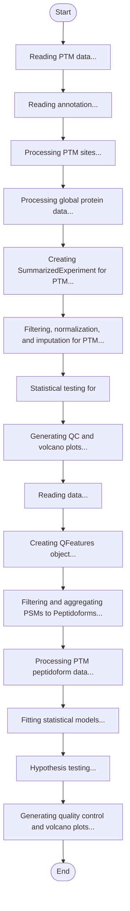

# PhosR MaxQuant TMT Analysis


## Installation

**[⬇️ Click here to install in Cauldron](http://localhost:50060/install?repo=https%3A%2F%2Fgithub.com%2Fnoatgnu%2Fphosr-maxquant-tmt-plugin)** _(requires Cauldron to be running)_

> **Repository**: `https://github.com/noatgnu/phosr-maxquant-tmt-plugin`

**Manual installation:**

1. Open Cauldron
2. Go to **Plugins** → **Install from Repository**
3. Paste: `https://github.com/noatgnu/phosr-maxquant-tmt-plugin`
4. Click **Install**

**ID**: `phosr-maxquant-tmt`  
**Version**: 1.0.0  
**Category**: statistics  
**Author**: CauldronGO Team

## Description

Comprehensive phosphoproteomic data analysis including normalization, differential analysis, kinase activity prediction, pathway enrichment, PTM-SET analysis, and signaling network visualization using PhosR. Based on: Kim et al. (2021) Cell Reports 34(8):108771. Repository: https://bioconductor.org/packages/PhosR


## Workflow Diagram



## Runtime

- **Environments**: `r`

- **Entrypoint**: `phosr_maxquant_tmt_modular.R`

## Inputs

| Name | Label | Type | Required | Default | Visibility |
|------|-------|------|----------|---------|------------|
| `input_file` | PTM Evidence File | file | Yes | - | Always visible |
| `fasta_file` | FASTA File | file | No | - | Always visible |
| `annotation_file` | PTM Annotation File | file | Yes | - | Always visible |
| `annotation_protein_file` | Protein Annotation File | file | No | - | Always visible |
| `feature_id_col` | PTM Feature ID Column | text | Yes | Sequence | Always visible |
| `site_col` | PTM Site Column | text | Yes | Modified sequence | Always visible |
| `protein_col` | PTM Protein Column | text | Yes | Proteins | Always visible |
| `probability_col` | PTM Probability Column | text | No | Phospho (STY) Probabilities | Always visible |
| `min_probability` | Minimum Localization Probability | number (min: 0, max: 1, step: 0) | No | 0.75 | Always visible |
| `protein_file` | Protein Evidence File | file | No | - | Always visible |
| `protein_feature_id_col` | Protein Feature ID Column | text | No | Sequence | Always visible |
| `protein_id_col` | Protein ID Column | text | No | Proteins | Always visible |
| `comparison_file` | Comparison Matrix File | file | No | - | Always visible |
| `log2_transform` | Apply Log2 Transformation | boolean | No | true | Always visible |
| `exclude_conditions` | Exclude Conditions (comma-separated) | text | No | - | Always visible |
| `remove_norm_channel` | Remove 'Norm' Channel | boolean | No | true | Always visible |
| `col_filter` | Column Completeness Threshold | number (min: 0, max: 1, step: 0) | No | 0.7 | Always visible |
| `row_filter` | Row Completeness Threshold | number (min: 0, max: 1, step: 0) | No | 0.7 | Always visible |
| `impute_order` | Imputation Order | select (before, after) | No | after | Always visible |
| `impute` | Imputation Method | select (none, knn, MinDet, MinProb, min, zero, mixed, nbavg, with, QRILC, MLE, bpca) | No | knn | Always visible |
| `normalize_method` | Normalization Method | select (none, center.median, center.mean, quantiles, quantiles.robust, vsn) | No | center.median | Always visible |
| `aggregation_order` | Aggregation Order | select (before, after) | No | after | Always visible |
| `summarization_method` | Protein Summarization Method | select (mean, median, sum) | No | mean | Always visible |
| `adjust_method` | P-value Adjustment Method | select (BH, bonferroni, holm, hochberg, BY, none) | No | BH | Always visible |
| `alpha` | Significance Level | number (min: 0, max: 0, step: 0) | No | 0.05 | Always visible |
| `lfc_threshold` | Log2 Fold Change Threshold | number (min: 0, max: 5, step: 0) | No | 1 | Always visible |
| `organism` | Organism | select (human, mouse) | Yes | human | Always visible |
| `perform_kinase_analysis` | Perform Kinase Activity Analysis | boolean | No | true | Always visible |
| `kinase_top_substrates` | Top Substrates for Kinase Prediction | number (min: 10, max: 100, step: 5) | No | 30 | Visible when `perform_kinase_analysis` = `true` |
| `kinase_score_threshold` | Kinase Score Threshold | number (min: 0, max: 1, step: 0) | No | 0.8 | Visible when `perform_kinase_analysis` = `true` |
| `kinase_num_motifs` | Number of Kinase Motifs | number (min: 1, max: 10, step: 1) | No | 5 | Visible when `perform_kinase_analysis` = `true` |
| `top_pathways_plot` | Top Pathways to Plot | number (min: 10, max: 50, step: 5) | No | 20 | Always visible |
| `top_ptmset_plot` | Top PTM-SETs to Plot | number (min: 10, max: 50, step: 5) | No | 20 | Always visible |
| `top_diff_sites_heatmap` | Top Differential Sites in Heatmap | number (min: 10, max: 100, step: 10) | No | 50 | Visible when `perform_kinase_analysis` = `true` |
| `top_phosphosite_heatmap` | Top Phosphosites by Variance in Heatmap | number (min: 10, max: 100, step: 10) | No | 50 | Visible when `perform_kinase_analysis` = `true` |
| `network_plot_top_interactions` | Top Kinase-Substrate Interactions to Plot | number (min: 20, max: 100, step: 10) | No | 50 | Visible when `perform_kinase_analysis` = `true` |

### Input Details

#### PTM Evidence File (`input_file`)

MaxQuant evidence.txt file with PTM data (e.g., from phospho search)


#### FASTA File (`fasta_file`)

Protein database FASTA file for site mapping


#### PTM Annotation File (`annotation_file`)

Sample annotation with columns: Sample, Condition, BioReplicate


#### Protein Annotation File (`annotation_protein_file`)

Sample annotation for protein data (same format as PTM annotation)


#### PTM Feature ID Column (`feature_id_col`)

Column name for feature identifiers in PTM file (stripped sequence)


#### PTM Site Column (`site_col`)

Column name for PTM site information (modified sequence)


#### PTM Protein Column (`protein_col`)

Column name for protein identifiers in PTM file


#### PTM Probability Column (`probability_col`)

Column name for site localization probabilities (e.g., Phospho (STY) Probabilities)


#### Minimum Localization Probability (`min_probability`)

Minimum probability score for valid PTM sites (0-1)


#### Protein Evidence File (`protein_file`)

MaxQuant evidence.txt file for protein-level data (optional)


#### Protein Feature ID Column (`protein_feature_id_col`)

Column name for peptide sequence in protein evidence file


#### Protein ID Column (`protein_id_col`)

Column name for protein IDs in protein evidence file


#### Comparison Matrix File (`comparison_file`)

Pairwise comparisons (columns: comparison_label, condition_A, condition_B)


#### Apply Log2 Transformation (`log2_transform`)

Apply log2 transformation to intensities


#### Exclude Conditions (comma-separated) (`exclude_conditions`)

Comma-separated list of conditions to exclude from analysis (e.g., 'Norm,Empty')


#### Remove 'Norm' Channel (`remove_norm_channel`)

Automatically remove samples with condition 'Norm'


#### Column Completeness Threshold (`col_filter`)

Maximum proportion of missing values allowed per sample. Default 0.7 = keep samples with ≥30% valid measurements.


#### Row Completeness Threshold (`row_filter`)

Maximum proportion of missing values allowed per feature. Default 0.7 = keep features with ≥30% valid measurements.


#### Imputation Order (`impute_order`)

When to impute missing values relative to normalization. 'after': normalize then impute. 'before': impute then normalize.

- **Options**: `before`, `after`

#### Imputation Method (`impute`)

Imputation method for missing values

- **Options**: `none`, `knn`, `MinDet`, `MinProb`, `min`, `zero`, `mixed`, `nbavg`, `with`, `QRILC`, `MLE`, `bpca`

#### Normalization Method (`normalize_method`)

Normalization method to apply

- **Options**: `none`, `center.median`, `center.mean`, `quantiles`, `quantiles.robust`, `vsn`

#### Aggregation Order (`aggregation_order`)

When to aggregate peptides to proteins. 'after': normalize/impute peptides then aggregate. 'before': aggregate peptides then normalize proteins.

- **Options**: `before`, `after`

#### Protein Summarization Method (`summarization_method`)

Method for combining peptide intensities to protein level. 'mean': arithmetic mean. 'median': median. 'sum': sum.

- **Options**: `mean`, `median`, `sum`

#### P-value Adjustment Method (`adjust_method`)

Method for multiple testing correction

- **Options**: `BH`, `bonferroni`, `holm`, `hochberg`, `BY`, `none`

#### Significance Level (`alpha`)

Adjusted p-value threshold for significance


#### Log2 Fold Change Threshold (`lfc_threshold`)

Minimum absolute log2 fold-change threshold for significance


#### Organism (`organism`)

Organism for kinase-substrate database

- **Options**: `human`, `mouse`

#### Perform Kinase Activity Analysis (`perform_kinase_analysis`)

Predict kinase activities and kinase-substrate relationships


#### Top Substrates for Kinase Prediction (`kinase_top_substrates`)

Number of top substrates to select per kinase


#### Kinase Score Threshold (`kinase_score_threshold`)

Minimum score threshold for kinase-substrate predictions


#### Number of Kinase Motifs (`kinase_num_motifs`)

Number of motifs to consider in kinase-substrate scoring (higher values increase sensitivity but computation time)


#### Top Pathways to Plot (`top_pathways_plot`)

Number of top enriched pathways to show in plots


#### Top PTM-SETs to Plot (`top_ptmset_plot`)

Number of top enriched kinase substrate sets to show in plots


#### Top Differential Sites in Heatmap (`top_diff_sites_heatmap`)

Number of top differential phosphosites to show in heatmap


#### Top Phosphosites by Variance in Heatmap (`top_phosphosite_heatmap`)

Number of phosphosites with highest kinase score variance to show in heatmap


#### Top Kinase-Substrate Interactions to Plot (`network_plot_top_interactions`)

Number of top kinase-substrate interactions to show in network plots


## Outputs

| Name | File | Type | Format | Description |
|------|------|------|--------|-------------|
| `dpa_results` | `dpa_results.txt` | data | tsv | Differential Phosphosite Abundance (DPA) results from MSqRob2 analysis. Contains logFC, p-values, and adjusted p-values for each phosphosite across all comparisons. Rows represent phosphosites, columns include statistical measures and comparison information. |
| `dpu_results_phosr_format` | `dpu_results_phosr_format.txt` | data | tsv | Differential Protein Use (DPU) results in PhosR format. Contains phosphosite differential analysis normalized by protein abundance. Includes PhosR_ID (GENE;SITE; format), Gene symbols, feature IDs, and statistical results across all comparisons. Used for downstream PhosR pathway and kinase analyses. |
| `phosphosite_intensities` | `phosphosite_intensities.txt` | data | tsv | Normalized log2-transformed phosphosite intensities. Matrix with phosphosites in rows and samples in columns. Values represent normalized abundance levels after QC filtering, normalization, and optional imputation. Used as input for differential analysis. |
| `kinase_substrate_scores` | `kinase_substrate_scores.txt` | data | tsv | PhosR kinase-substrate prediction scores. Matrix with phosphosites (PhosR_ID format: GENE;SITE;) in rows and kinases in columns. Scores represent predicted kinase-substrate relationships based on sequence motif matching and PhosphoSitePlus database. Higher scores indicate stronger evidence of kinase-substrate relationship. |
| `kinase_activities` | `kinase_activities.txt` | data | tsv | Predicted kinase activities across experimental conditions. Contains mean kinase activity scores per condition, calculated from substrate phosphorylation levels weighted by kinase-substrate prediction scores. Rows represent kinases, columns represent conditions. |
| `differential_kinase_activities` | `differential_kinase_activities.txt` | data | tsv | Differential kinase activity scores between condition pairs. Shows log2 fold-changes in predicted kinase activities for each comparison. Indicates which kinases are more or less active between experimental conditions. |
| `top_differential_sites_data` | `top_differential_sites.txt` | data | tsv | Top differential phosphosites per comparison (default: top 50 per comparison). Filtered to include only sites with kinase scoring data. Contains logFC, adjusted p-values, PhosR_ID, Gene, feature IDs, and significance flags. Sorted by absolute logFC within each comparison. |
| `pathway_enrichment_all_comparisons` | `pathway_enrichment_all_comparisons.txt` | data | tsv | Combined Reactome pathway enrichment results for all comparisons. Each row represents an enriched pathway with pathway ID, name, gene counts, p-values, adjusted p-values, and comparison label. Uses Fisher's exact test for over-representation analysis of genes with significant phosphosite changes. |
| `ptmset_enrichment_all_comparisons` | `ptmset_enrichment_all_comparisons.txt` | data | tsv | Combined PhosR PTM-SET (kinase substrate set) enrichment results for all comparisons. Each row represents a kinase with enriched substrates, including kinase name, substrate counts, p-values, adjusted p-values, and comparison label. Identifies kinases whose known substrates are over-represented among significant phosphosites. |
| `kinase_substrate_network_all_comparisons` | `kinase_substrate_network_all_comparisons.txt` | data | tsv | Combined kinase-substrate interaction networks for all comparisons. Each row represents a kinase-substrate pair with prediction score, substrate PhosR_ID, gene name, and comparison label. Filtered to significant phosphosites only. Shows which kinases are predicted to regulate which phosphosites in each comparison. |
| `qc_plots` | `qc_plots.pdf` | plot | pdf | Quality control visualizations: sample boxplots (intensity distributions), PCA plots (sample clustering), and correlation heatmaps. Includes both DPA and DPU data if both analyses are performed. Helps assess data quality, batch effects, and sample relationships. |
| `volcano_plots` | `volcano_plots.pdf` | plot | pdf | Volcano plots for differential phosphorylation across all comparisons. Each plot shows -log10(p-value) vs log2(fold-change) with significance thresholds indicated. Points colored by significance status. Helps visualize magnitude and significance of phosphosite changes. |
| `kinase_heatmap` | `kinase_heatmap.pdf` | plot | pdf | Kinase activity heatmaps and differential activity bar plots. Main heatmap shows row-scaled kinase activities across conditions with hierarchical clustering. Bar plots show differential kinase activities for each comparison. Visualizes kinase activation patterns across experimental design. |
| `phosphosite_heatmap` | `phosphosite_heatmap.pdf` | plot | pdf | Heatmap of top phosphosites with highest kinase score variance. Shows phosphosites (rows) with most variable kinase predictions across kinases (columns). Identifies sites regulated by multiple kinases or showing kinase-specific patterns. |
| `site_class_distribution` | `site_class_distribution.pdf` | plot | pdf | Bar plots showing distribution of phosphorylated residue types (pS, pT, pY). Includes overall distribution and per-condition counts. Helps assess phosphoproteome coverage and potential biases in site detection. |
| `top_differential_sites_heatmap` | `top_differential_sites.pdf` | plot | pdf | Intensity heatmap of top differential phosphosites across all samples. Shows log2 intensity values (row-scaled) for top significant sites (filtered by adjusted p-value and fold-change thresholds, limited to sites with kinase data). Displays DPU values if DPU analysis performed, otherwise DPA values. Reveals clustering patterns and regulation of most significantly changing phosphosites. |
| `kinase_family_analysis` | `kinase_family_analysis.pdf` | plot | pdf | Kinase family-level analysis plots. Bar chart showing number of detected kinases per family and heatmap of family-grouped kinase activities across conditions. Helps identify coordinated regulation at the kinase family level. |
| `pathway_enrichment_plots` | `pathway_enrichment.pdf` | plot | pdf | Reactome pathway enrichment visualizations for all comparisons. Bar plots show top enriched pathways ranked by -log10(p-value), colored by adjusted p-value. Bubble plots show pathway enrichment across comparisons with bubble size representing gene count. Identifies biological processes affected by phosphorylation changes. |
| `ptmset_enrichment_plots` | `ptmset_enrichment.pdf` | plot | pdf | PTM-SET kinase substrate enrichment visualizations for all comparisons. Bar plots show top enriched kinase substrate sets ranked by -log10(p-value). Bubble plots show enrichment patterns across comparisons. Identifies kinases whose substrates are coordinately regulated. |
| `kinase_substrate_network_plots` | `kinase_substrate_network.pdf` | plot | pdf | Network visualizations of top kinase-substrate interactions for each comparison. Bar plots show top kinase-substrate pairs ranked by prediction score. Network plots display kinases (colored nodes) connected to their predicted substrates (gray nodes) with edge width representing score strength. Reveals signaling network topology for significant phosphosites. |

## Requirements

- **R Version**: >=4.2

### R Dependencies (External File)

Dependencies are defined in: `r-packages.txt`

- `QFeatures`
- `msqrob2`
- `MsCoreUtils`
- `PhosR`
- `impute`
- `limma`
- `ggplot2`
- `pheatmap`
- `RColorBrewer`
- `reshape2`
- `S4Vectors`
- `Biostrings`
- `SummarizedExperiment`
- `reactome.db`
- `org.Hs.eg.db`
- `org.Mm.eg.db`

> **Note**: When you create a custom environment for this plugin, these dependencies will be automatically installed.

## Example Data

This plugin includes example data for testing:

```yaml
  summarization_method: mean
  adjust_method: BH
  organism: human
  input_file: maxquant-tmt/evidence_ptm.txt
  annotation_protein_file: maxquant-tmt/annotation_protein_msqrob2.txt
  probability_col: Phospho (STY) Probabilities
  log2_transform: true
  normalize_method: center.median
  aggregation_order: after
  perform_kinase_analysis: true
  fasta_file: maxquant-tmt/uniprot_human.fasta
  feature_id_col: Sequence
  protein_file: maxquant-tmt/evidence_protein.txt
  remove_norm_channel: true
  row_filter: 0.7
  impute_order: after
  site_col: Modified sequence
  min_probability: 0.75
  exclude_conditions: Norm
  col_filter: 0.7
  impute: knn
  kinase_top_substrates: 30
  annotation_file: maxquant-tmt/annotation_ptm_msqrob2.txt
  protein_col: Proteins
```

Load example data by clicking the **Load Example** button in the UI.

## Usage

### Via UI

1. Navigate to **statistics** → **PhosR MaxQuant TMT Analysis**
2. Fill in the required inputs
3. Click **Run Analysis**

### Via Plugin System

```typescript
const jobId = await pluginService.executePlugin('phosr-maxquant-tmt', {
  // Add parameters here
});
```
